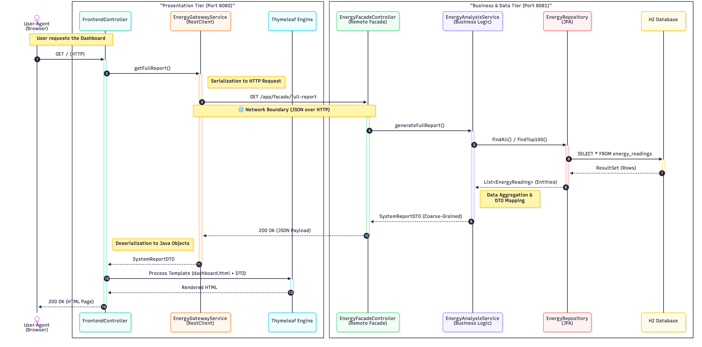

# ⚡ Distributed Energy Consumption Monitor

A distributed software system designed to monitor, analyze, and predict building energy consumption.  
This project implements a **Multi-Tier Architecture** separating the Presentation Layer from the Business Logic/Data Layer, demonstrating key distributed systems patterns like **Remote Facade**, **BFF (Backend for Frontend)**, and **DTOs**.

---

## 🏛️ System Architecture

The system is composed of two distinct Spring Boot microservices communicating via HTTP REST.


### 1. Energy Server (Backend - Port 8081)
* **Role:** Business Logic & Data Persistence.
* **Pattern:** Exposes a **Coarse-Grained Remote Facade** to minimize network chattiness.
* **Responsibility:**
    * Manages the H2 Database via Spring Data JPA.
    * Performs ETL operations (CSV Batch Ingestion).
    * Aggregates data into complex DTOs (`SystemReportDTO`).
    * Simulates AI analysis and anomaly detection.

### 2. Energy Client (Frontend - Port 8080)
* **Role:** Presentation Layer (BFF).
* **Pattern:** **Backend-for-Frontend** & **Proxy**.
* **Responsibility:**
    * Stateless service rendering HTML via **Thymeleaf**.
    * Consumes Backend APIs using `Spring RestClient`.
    * Handles user interaction and data visualization.
    * **No Client-Side Logic:** Pure Server-Side Rendering (SSR) without JavaScript.

---

## 🔄 Request Workflow (Sequence Diagram)

When a user requests the dashboard, the Client acts as a proxy, fetching aggregated data from the Server transparently.



---

## 🛠️ Tech Stack

* **Language:** Java 21 (LTS)
* **Framework:** Spring Boot 3.3.x
* **Build Tool:** Maven
* **Database:** H2 Database (In-Memory)
* **Frontend Engine:** Thymeleaf (Server-Side Rendering)
* **Communication:** REST over HTTP
* **Utilities:** Lombok, Spring DevTools

---

## 🚀 Getting Started

### Prerequisites
* Java JDK 21+
* Maven 3.8+

### 1. Start the Server (Backend)

The backend must be started first to accept connections.

```bash
cd energy-server
mvn clean spring-boot:run
```

The server will start on port 8081.

### 2. Start the Client (Frontend)

Open a new terminal window.

```bash
cd energy-client
mvn clean spring-boot:run
```

The client will start on port 8080.

### 3. Access the Dashboard

Open your browser and navigate to: 👉 [http://localhost:8080](http://localhost:8080)

---

## 📊 Features & Usage

### CSV Batch Ingestion:
1. On the dashboard header, click "Import CSV".
2. Select the provided `Energy_consumption.csv` file from the root directory.
3. The system will parse and load thousands of records in seconds.

### Dashboard Monitoring:
* View real-time statistics (Average Temp, Total Consumption, Peak Load).
* View AI-simulated insights and anomaly detection.

### CRUD Operations:
* **Create:** Manually add a new sensor reading.
* **Edit:** Modify existing records via the UI.
* **Delete:** Remove records from the database.

### Weekly Analysis:
* Visualize aggregated average consumption grouped by day of the week (New Endpoint).

---

## 🔌 API Reference (Server Internal API)

The Client consumes the following Coarse-Grained APIs exposed by the Server:

| Method | Endpoint                        | Description                                | Pattern          |
|--------|----------------------------------|--------------------------------------------|------------------|
| GET    | `/api/facade/full-report`    | Returns the complete system state (Stats + List + AI) | Remote Facade   |
| POST   | `/api/facade/ingest-dataset` | Uploads and processes the CSV batch file  | Batch Processing |
| GET    | `/api/facade/stats/weekly`   | Returns aggregated consumption by day of week | Aggregation      |

---

## 🗄️ Database Access

You can inspect the raw data directly on the Backend H2 Console.

* **URL:** [http://127.0.0.1:8081/h2-console](http://127.0.0.1:8081/h2-console)
* **JDBC URL:** `jdbc:h2:mem:energydb`
* **User:** `sa`
* **Password:** `password`

---

## 📄 License

This project is licensed under the MIT License - see the LICENSE file for details.