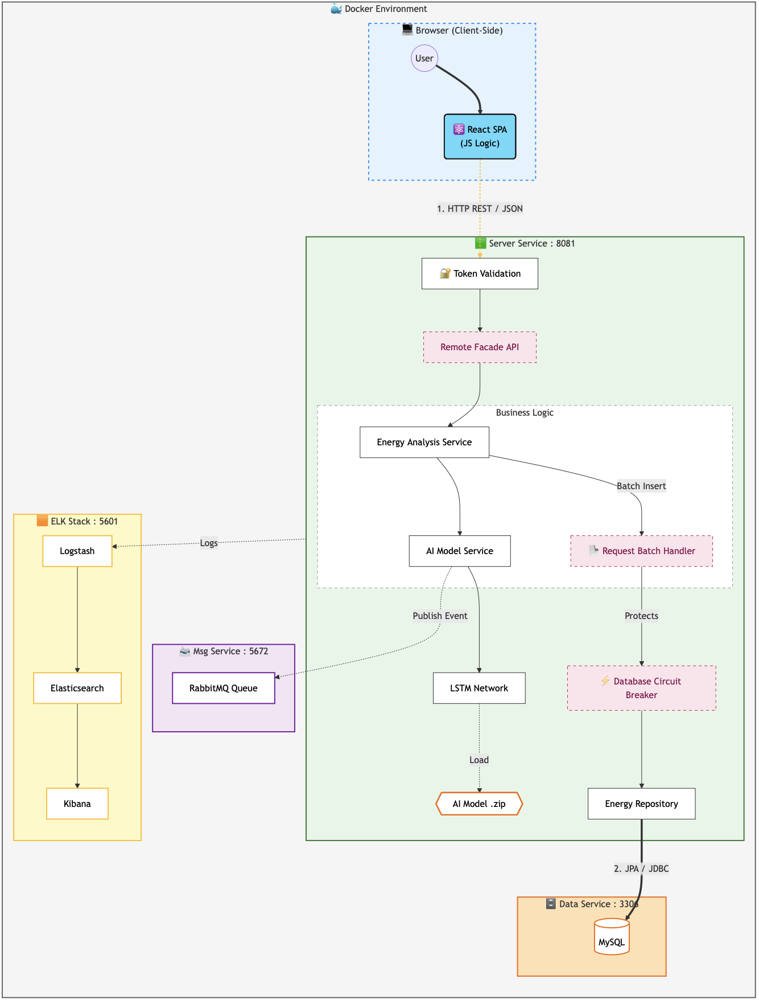

# Nexus Energy Distributed Service

Nexus Energy Distributed Service is a full‑stack, distributed platform designed for high‑fidelity monitoring, predictive analytics, and intelligent visualization of building energy consumption. The system combines modern frontend engineering, a scalable multi‑tier backend, deep learning–driven inference, and enterprise‑grade observability into a cohesive ecosystem.

The primary objective of this project is to demonstrate how heterogeneous technologies can be integrated into a single production‑ready architecture capable of ingesting telemetry, running real‑time AI predictions, and delivering actionable insights through a modern user interface.

This repository showcases not only a working distributed system, but also the full research and engineering lifecycle: dataset exploration, feature engineering, model training, API design, system orchestration, and user‑centric visualization.

The dataset used for reproducibility and model research can be accessed via the following link:

[](https://www.kaggle.com/datasets/mrsimple07/energy-consumption-prediction)


---

## Conceptual Vision

The platform is built around the concept of a **Digital Energy Twin**: a neural model continuously learns from telemetry streams and produces a predicted energy consumption value. By comparing predicted versus actual consumption, the system identifies inefficiencies, behavioral anomalies, and potential optimization opportunities.

This approach mirrors real industrial energy‑management systems used in smart buildings and Industry 4.0 environments, where predictive intelligence is used to reduce costs and improve sustainability.

---

## Data Science & Analytical Foundation

A critical pillar of this project is the rigorous analytical foundation established prior to the implementation of the AI engine. Rather than a superficial review, a deep exploratory analysis was conducted to fully understand the dataset's underlying properties and statistical behaviors.

### Exploratory Data Analysis (EDA)
**Location:** `energy-server/dataset/python_viz/analysis.ipynb`

The analysis focused on surfacing non-obvious data properties and ensuring the model's predictive validity:

* **Property Discovery**: Detailed profiling of distribution shapes for environmental variables and energy metrics to detect skewness and outliers.
* **Temporal Seasonality**: Analysis of consumption patterns across different time scales (hourly, daily, and weekly) to identify cyclical dependencies.
* **Feature Correlation**: Deep investigation into the relationships between occupancy, HVAC status, and energy load to drive feature selection for the LSTM network.
* **Data Preparation**: Design of normalization pipelines and cyclical time encoding (sine/cosine) based on the observed data ranges to ensure stable neural convergence.

This analytical depth ensures that the resulting **Digital Twin** is grounded in the actual physical properties of the monitored infrastructure.

---

## System Architecture

The project follows a distributed, multi‑tier architecture orchestrated via Docker Compose. Each layer is isolated by responsibility to ensure scalability, maintainability, and technology independence.

### High‑Level Architecture Layers

1. Presentation Layer (energy-client)
2. Service & AI Layer (energy-server)
3. Data & Observability Layer (MySQL + ELK Stack)

Each component is containerized, enabling reproducible deployment across environments. Below is the high-level architecture diagram illustrating the system's components and their interactions:

<p align="center">
    
</p>

---

### Enterprise Resilience & Reliability
The system implements advanced reliability patterns to ensure zero data loss during high-load ingestion or infrastructure failures:

*   **Circuit Breaker (Resilience4j):** Protects the system from cascading failures. If the database becomes unresponsive, the system automatically opens the circuit to prevent resource exhaustion.
*   **Event-Driven Fallback:** When the database circuit is open, telemetry is transparently rerouted to **RabbitMQ Quorum Queues** for persistent buffering.
*   **Self-Healing Recovery:** A dedicated background service automatically consumes the fallback queue and reconciles the data with the primary store once stability is restored.
*   **Atomic Auditing:** An in-memory audit service tracks telemetry flow across CSV ingestion, queues, and database to guarantee data integrity.

---

## 1. Presentation Layer – energy-client

### Technology Stack
- React 18
- TypeScript
- Vite
- Tailwind CSS
- Recharts
- Lucide Icons

### Architectural Pattern
The frontend implements the **Backend for Frontend (BFF)** consumption model, relying on aggregated endpoints rather than multiple fine‑grained API calls. This reduces latency and simplifies state synchronization.

### Core Capabilities

#### Dynamic Data Explorer
A multi‑level nested filtering engine allows users to explore telemetry by:
- Temporal dimensions (day, hour, seasonality)
- Environmental parameters (humidity, HVAC activity)
- Numerical thresholds (energy usage ranges)

This enables deep analytical drill‑down without requiring external BI tools.

#### Real‑Time Telemetry Visualization
The UI renders Server‑Sent Events (SSE) streams in real time, plotting:
- Actual consumption
- AI‑predicted consumption
- Delta deviation between the two

This provides immediate feedback on system behavior and model performance.

#### State Persistence & UX Engineering
Advanced UI continuity features preserve user context during data updates:
- Scroll position locking via `useRef`
- Non‑blocking state transitions
- Smooth re‑rendering strategies

The result is a responsive interface capable of handling continuous data streams without degrading usability.


---

## 2. Service Layer – energy-server

### Technology Stack
- Java 21
- Spring Boot 3
- Deeplearning4j (DL4J)

### Architectural Patterns

#### Remote Facade Pattern
The backend exposes coarse‑grained endpoints such as `/api/full-report` to minimize network chatter and aggregate multiple internal computations into a single response payload.

#### Command & Observer Patterns
- Simulation control endpoints act as command triggers
- SSE endpoints implement the observer model for live data streaming

### AI Inference Engine

The system integrates a Long Short‑Term Memory (LSTM) neural network implemented in DL4J.

#### Digital Twin Simulation
The AI engine continuously:
- Receives telemetry
- Produces predicted consumption values
- Compares prediction vs reality
- Flags efficiency deviations

This design demonstrates real‑time inference in a production‑like environment rather than offline batch prediction.


---

## 3. Data & Observability Layer

### MySQL 8.0
MySQL acts as the persistent telemetry and configuration store, supporting:
- Historical consumption logs
- User data
- System state metadata

### ELK Stack

#### Logstash
Transforms and normalizes logs from all services into structured events.

#### Elasticsearch
Indexes telemetry and logs for fast querying, time‑series search, and aggregation.

#### Kibana
Provides observability dashboards, including:
- Anomaly heatmaps
- Model confidence visualization
- System health monitoring

This observability layer brings the project to enterprise‑grade standards by making every subsystem transparent and measurable.


---

## Data Science & Model Development Workflow

A major pillar of this project is the rigorous analytical work conducted before the AI engine was implemented.

### Dataset Analysis Notebook

Location:
`energy-server/dataset/python_viz/analysis.py`

This notebook represents a full scientific workflow including:

#### Exploratory Data Analysis (EDA)
- Identification of seasonal patterns
- Correlation between occupancy and energy consumption
- Distribution profiling of environmental variables

#### Feature Engineering
- Cyclical time encoding (sine/cosine transformations)
- Normalization strategies for stable neural convergence
- Temporal windowing for LSTM input sequences

#### Visualization & Statistical Validation
- Correlation matrices
- Distribution plots
- Trend decomposition

The findings of this notebook directly informed:
- Neural network architecture design
- Feature selection
- Backend inference pipeline behavior

The project therefore maintains **full reproducibility** between research and production.

---

## Security Architecture

Security is treated as a first-class architectural concern across the entire distributed system. The platform adopts a stateless security model aligned with modern cloud-native and microservice-oriented best practices.

### Stateless Authentication with JWT

All protected endpoints are secured using **JSON Web Tokens (JWT)**. Upon successful authentication, the backend issues a signed token that encapsulates the user identity and assigned roles. Each subsequent request must present this token, allowing the system to remain fully stateless while ensuring authentication and authorization guarantees.

This approach enables horizontal scalability without relying on server-side session storage.

### Role-Based Access Control (RBAC)

The system enforces **Role-Based Access Control (RBAC)** to clearly separate responsibilities and privileges:

- **ADMIN**: Authorized to perform privileged and potentially destructive operations, including:
  - Starting and stopping simulations
  - Clearing telemetry data
  - Managing users and roles
- **USER (Observer)**: Restricted to read-only operations such as:
  - Accessing live telemetry streams
  - Viewing aggregated analytics and reports

This separation ensures that critical system controls cannot be accessed unintentionally or maliciously.

### Token Revocation Strategy

Although JWT-based authentication is stateless by design, the platform mitigates replay risks through an explicit token revocation mechanism.

A dedicated **BlacklistService** tracks invalidated tokens at logout time. Any incoming request presenting a blacklisted token is rejected, effectively preventing token reuse after logout and adding an additional security layer without compromising architectural statelessness.

### Password Hashing and Credential Protection

All sensitive credentials are protected using the **BCrypt hashing algorithm** before persistence in the MySQL datastore. BCrypt provides adaptive hashing with built-in salting, significantly increasing resistance against brute-force and rainbow table attacks. At no point are plaintext passwords stored or logged within the system.

---

## API Surface

### Authentication & Identity Management

| Method | Endpoint                     | Description | Access |
|--------|------------------------------|-------------|--------|
| POST | /api/auth/register           | Registers a new user with default USER role | Public |
| POST | /api/auth/login              | Returns JWT and user profile | Public |
| POST | /api/auth/logout             | Invalidates JWT via blacklist | Authenticated |
| GET | /api/admin/users             | Lists all operators | Admin |
| POST | /api/admin/users/change-role | Updates user roles | Admin |
| DELETE | /api/admin/users/{id}        | Deletes an operator account | Admin |

### Telemetry & Simulation Control

| Method | Endpoint              | Description                     | Pattern |
|--------|-----------------------|---------------------------------|--------|
| POST | /api/simulation/start | Starts telemetry & inference    | Command |
| POST | /api/simulation/stop  | Stops simulation                | Command |
| GET | /api/stream           | SSE live telemetry feed         | Observer |
| GET | /api/auth/health      | System state check              | Diagnostic |
| GET | /api/simulation/state | Checks if simulation is running | Diagnostic |

### Aggregated Analytics

| Method | Endpoint | Description | Pattern |
|--------|----------|-------------|--------|
| GET | /api/full-report | Unified system report | Remote Facade |
| GET | /api/stats/weekly | Weekly trends | Aggregator |
| POST | /api/ingest-dataset | CSV batch import | Bulk Import |
| DELETE | /api/data/clear | Clears telemetry | Cleanup |


---

## DevOps & Deployment

### Container Orchestration

The entire ecosystem is deployed using Docker Compose, including:
- Frontend
- Backend
- MySQL
- Elasticsearch
- Logstash
- Kibana

### Installation Steps

#### Clone Repository
```
git clone git@github.com:nameisalfio/energy-distributed-service.git
cd energy-distributed-service
```

#### Environment Configuration
Create a `.env` file at the project root containing database credentials and system secrets. Refer to the provided template.

#### Launch Full Stack
```
docker-compose up --build
```

### AI Model Retraining

To retrain the LSTM model with updated data:
```
cd energy-server
mvn compile exec:java -Dexec.mainClass="com.energy.energy_server.ai.Train"
```

### AI Model Testing

To test the LSTM model performance on a holdout set:
```
cd energy-server
mvn compile exec:java -Dexec.mainClass="com.energy.energy_server.ai.EvaluateModel"
```

---
## 🛠 Testing & Integration

### Postman Collection
To facilitate rapid integration testing and API exploration, a pre-configured Postman Collection is provided in the repository root: `Nexus_Energy_API.postman_collection.json`.

**Capabilities included in the collection:**
* **Automated Auth Flow**: Scripts to automatically capture the JWT from the `/login` response and inject it into the `Authorization` header of subsequent requests.
* **Lifecycle Testing**: Ready-to-use requests for the full system lifecycle, from user registration to simulation control and batch data ingestion.
* **Environment Variables**: Pre-set variables for `base_url` to allow switching between local development and containerized environments.

---

## Technical Summary

| Component | Technology | Role |
|----------|------------|------|
| Frontend | React, Tailwind CSS | Visualization & UX |
| Backend | Spring Boot, DL4J | Business logic & AI inference |
| Database | MySQL 8.0 | Persistent storage |
| Observability | ELK Stack | Monitoring & analytics |
| DevOps | Docker | Orchestration |


---

## Project Value Proposition

This project demonstrates:

- A real distributed micro‑ecosystem rather than a monolithic demo
- Production‑style AI inference integration in Java
- End‑to‑end MLOps pipeline from dataset research to live predictions
- Enterprise‑grade observability with ELK
- Advanced frontend data visualization patterns
- Reproducible scientific methodology


---

## License

This project is licensed under the MIT License.